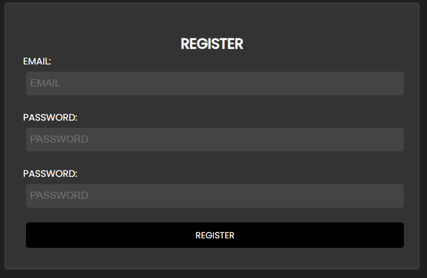
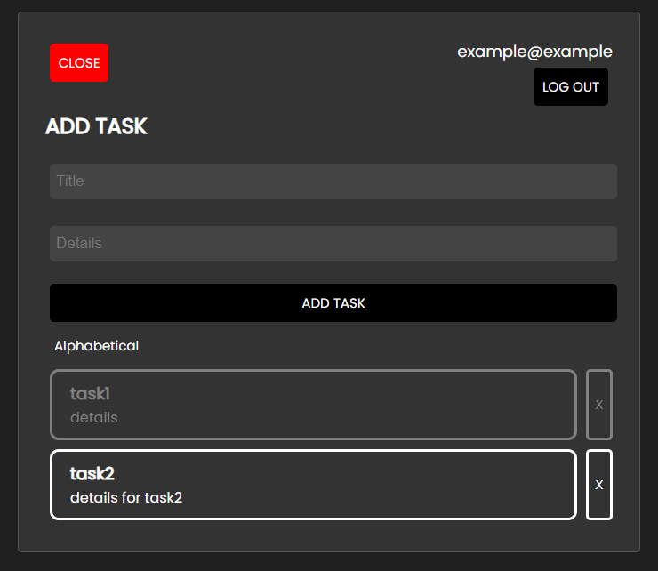
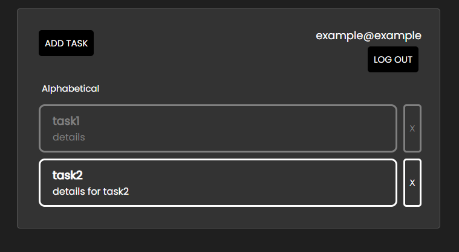

# TodoList

This project consists of a Todo List web application with both a backend (ASP\.NET + EF) and a frontend (React) components. The application allows users to create, read, update, and delete tasks in their todo list. It also includes authentication and authorization features.

## Screenshots:

